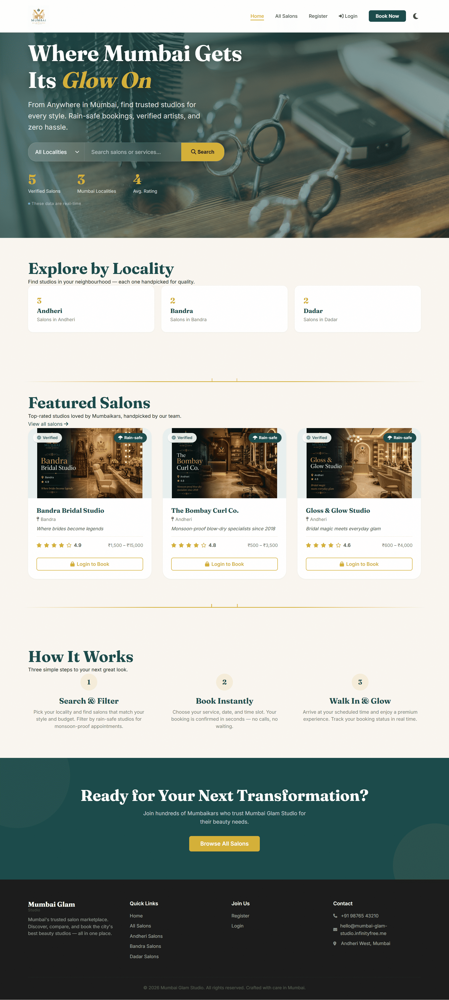
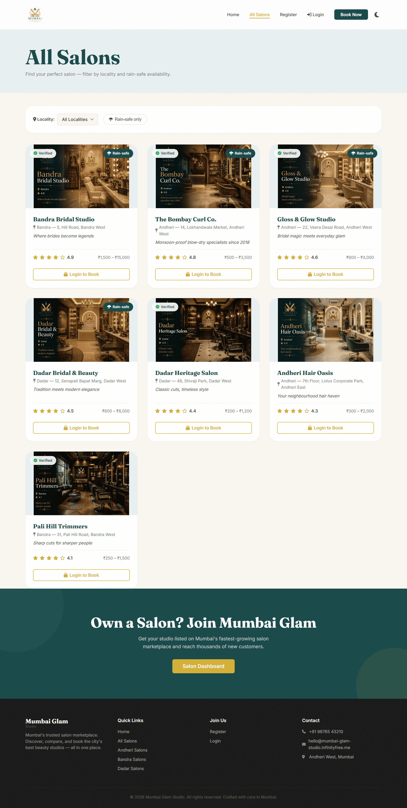
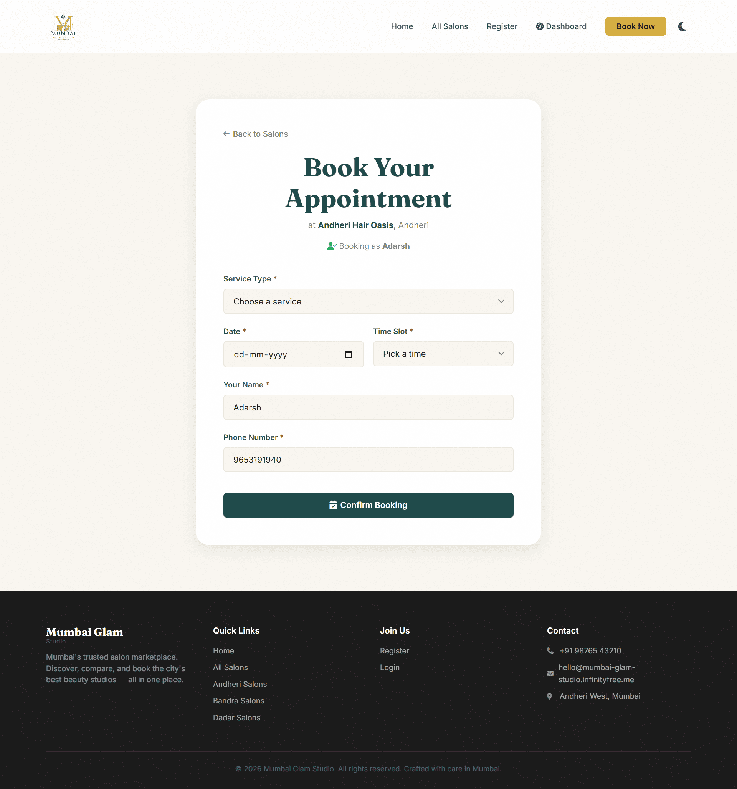
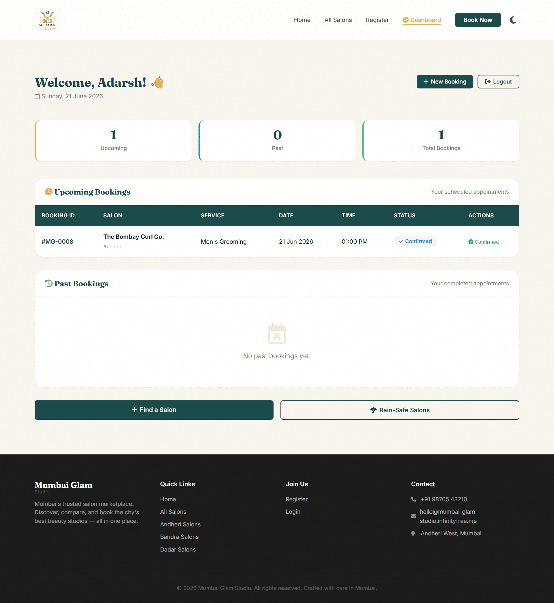
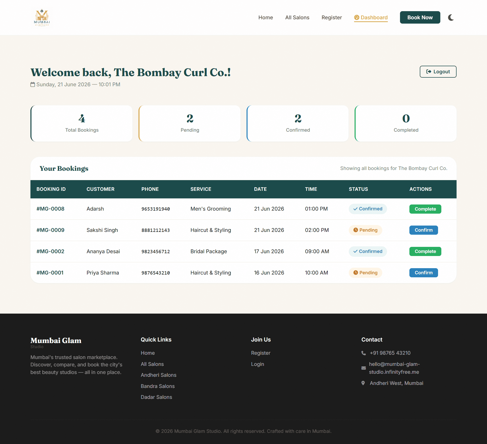
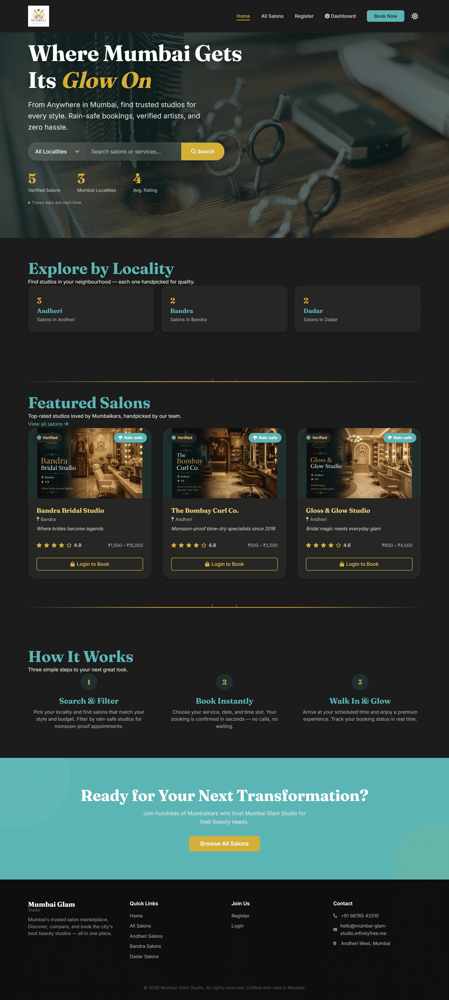

# 🌆 Mumbai Glam Studio

<p align="center">
  
  
  
  
  
</p>

<p align="center">
  <h3 align="center">✨ Where Mumbai Gets Its Glow On ✨</h3>
  <p align="center">
    A luxury beauty salon marketplace connecting customers with trusted salons across Mumbai through seamless discovery, booking, and business management.
  </p>
</p>

---

## 🌐 Live Platform

### 🔗 Live Website

https://mumbai-glam-studio.infinityfree.me/

### 🎥 Demo Video

*(Add YouTube/Loom link here)*

---

# 🏆 SuperXgen AI Startup Buildathon 2026

### Challenge Category

**Mumbai Salon Marketplace**

Mumbai Glam Studio was built as a startup-style MVP during the SuperXgen AI Startup Buildathon 2026.

The goal was simple:

> Build a modern, scalable beauty marketplace that helps customers discover trusted salons while empowering salon owners with digital booking management tools.

---

# 💡 Problem Statement

Mumbai is home to thousands of beauty salons, yet discovering reliable salons and managing appointments remains fragmented.

Customers often face:

* Lack of trusted salon discovery
* No centralized booking platform
* Difficulty comparing services
* Inconsistent business visibility
* Time-consuming appointment scheduling

For salon owners:

* Limited online presence
* Poor customer retention systems
* Manual appointment management

Mumbai Glam Studio addresses these challenges through a unified marketplace experience.

---

# 🚀 Solution

Mumbai Glam Studio is a full-stack beauty-tech marketplace that enables:

### 👩 Customers

* Browse salons by locality
* Compare services
* Book appointments instantly
* Track upcoming bookings
* View booking history
* Manage appointments from a dedicated dashboard

### 💇 Salon Owners

* Register and list salons
* Receive appointment requests
* Manage bookings
* Update booking statuses
* Increase online visibility

### 🛡 Platform Administrators

* Verify salons
* Moderate listings
* Maintain marketplace quality

---

# ✨ Key Features

## 🔍 Smart Salon Discovery

Users can discover salons through:

* Locality-based search
* Dynamic salon directory
* Premium salon cards
* Service visibility
* Rating display

---

## ☔ Rain-Safe Salon Filter

Mumbai's monsoon season often disrupts plans.

The platform includes a dedicated:

### Rain-Safe Filter

Customers can instantly discover salons that:

* Operate fully indoors
* Have weather-protected facilities
* Minimize appointment disruption risks

This feature is uniquely designed for Mumbai's lifestyle challenges.

---

## 📅 Appointment Booking System

Customers can:

* Select services
* Choose dates
* Pick time slots
* Confirm bookings instantly

The system prevents duplicate slot allocation and maintains booking integrity.

---

## 👤 Customer Dashboard

A dedicated customer portal provides:

* Upcoming Bookings
* Past Bookings
* Booking Status Tracking
* Appointment History
* Booking Statistics

---

## 🏢 Salon Dashboard

Salon owners receive:

* Appointment Management
* Customer Information
* Booking Status Updates
* Booking Analytics
* Operational Dashboard

Status Flow:

```text
Pending
   ↓
Confirmed
   ↓
Completed
```

---

## 🛡 Admin Verification System

Marketplace quality is maintained through an admin verification pipeline.

Administrators can:

* Verify salon registrations
* Approve listings
* Remove invalid salons
* Maintain platform trust

Verified salons receive enhanced credibility within the marketplace.

---

# 📊 Dynamic Marketplace Intelligence

The landing page automatically calculates:

* Total Verified Salons
* Active Mumbai Localities
* Community Average Ratings

All metrics are dynamically generated using live database aggregation queries.

---

# 🎨 User Experience & Design

Mumbai Glam Studio follows a luxury-first design philosophy.

### Design Highlights

* Luxury visual identity
* Premium typography
* Dark Mode support
* Mobile-first responsiveness
* Interactive animations
* Glassmorphism-inspired search experience
* Smooth micro-interactions

---

# 🤖 AI Development Workflow

This project was built using an AI-first development approach.

## AI Tools Used

| Tool                  | Purpose                                   |
| --------------------- | ----------------------------------------- |
| ChatGPT               | Product planning, architecture, debugging |
| DeepSeek              | Backend engineering assistance            |
| Cursor                | AI-assisted coding                        |
| Figma AI              | Wireframes and UX concepts                |
| AI Prompt Engineering | Workflow acceleration                     |

---

## AI Assisted Development Areas

### Product Design

* Marketplace strategy
* User journey planning
* Feature prioritization

### Development

* PHP architecture
* SQL query optimization
* Authentication systems
* Validation workflows

### UX Design

* Layout generation
* Design refinement
* Interaction improvements

### Documentation

* Technical documentation
* Repository management
* Buildathon presentation

---

# 🏗 Technical Architecture

## Frontend

* HTML5
* CSS3
* JavaScript
* Font Awesome

## Backend

* PHP
* Session Authentication
* Role-Based Access Control

## Database

* MySQL

## Hosting

* InfinityFree

## Version Control

* Git
* GitHub

---

# 🔒 Security Features

The platform implements:

* Password Hashing
* Session Management
* Prepared Statements
* Input Sanitization
* Authentication Middleware
* Role-Based Authorization

---

# 📂 Project Structure

```text
Mumbai_Glam_Studio/
│
├── assets/
│   ├── salons/
│   └── images/
│
├── includes/
│   ├── nav.php
│   └── header.php
│   └── footer.php
│
├── index.php
├── salons.php
├── booking.php
├── login.php
├── register.php
├── dashboard.php
├── customer_dashboard.php
├── logout.php
│
├── config.php
├── database.sql
├── script.js
├── style.css
│
└── README.md
```

---

# 📸 Product Showcase

All screenshots below were captured using the platform's premium dark theme.

---

## 🏠 Home Page

<p align="center">
  
</p>

<p align="center">
  <em>Marketplace landing page featuring real-time statistics, locality search, and luxury-themed user experience.</em>
</p>

---

## 💇 Salon Discovery

<p align="center">
  
</p>

<p align="center">
  <em>Discover verified salons across Mumbai with locality-based filtering and smart search capabilities.</em>
</p>

---

## 📅 Appointment Booking

<p align="center">
  
</p>

<p align="center">
  <em>Book appointments seamlessly by selecting services, preferred dates, and available time slots.</em>
</p>

---

## 👤 Customer Dashboard

<p align="center">
  
</p>

<p align="center">
  <em>Monitor upcoming appointments, booking history, and service status from a personalized dashboard.</em>
</p>

---

## 🏢 Salon Management Dashboard

<p align="center">
  
</p>

<p align="center">
  <em>Manage customer bookings, update appointment status, and streamline salon operations.</em>
</p>

---

## 🌙 Premium Dark Experience

<p align="center">
  
</p>

<p align="center">
  <em>A luxury dark interface designed to deliver a modern, elegant, and immersive user experience.</em>
</p>

---

# 📈 Future Roadmap

### Phase 2

* Online Payments
* Customer Reviews
* AI Salon Recommendations
* SMS Notifications
* Email Reminders

### Phase 3

* Mobile Application
* Multi-City Expansion
* Loyalty Programs
* Subscription Services
* Home Beauty Services

---

# 👥 Team

### Team Name

Mumbai Glam Studio

### Members

* Nitin Maurya
* Adarsh Pandey

---

# 🎯 Buildathon Deliverables

| Deliverable               | Status |
| ------------------------- | ------ |
| Live Website              | ✅      |
| GitHub Repository         | ✅      |
| Demo Video                | ✅      |
| AI Workflow Documentation | ✅      |
| Startup MVP               | ✅      |

---

# ❤️ Built for SuperXgen AI Startup Buildathon 2026

> This project demonstrates how AI-assisted development can rapidly transform an idea into a fully functional startup MVP within a limited timeframe.

### Build. Innovate. Launch.
