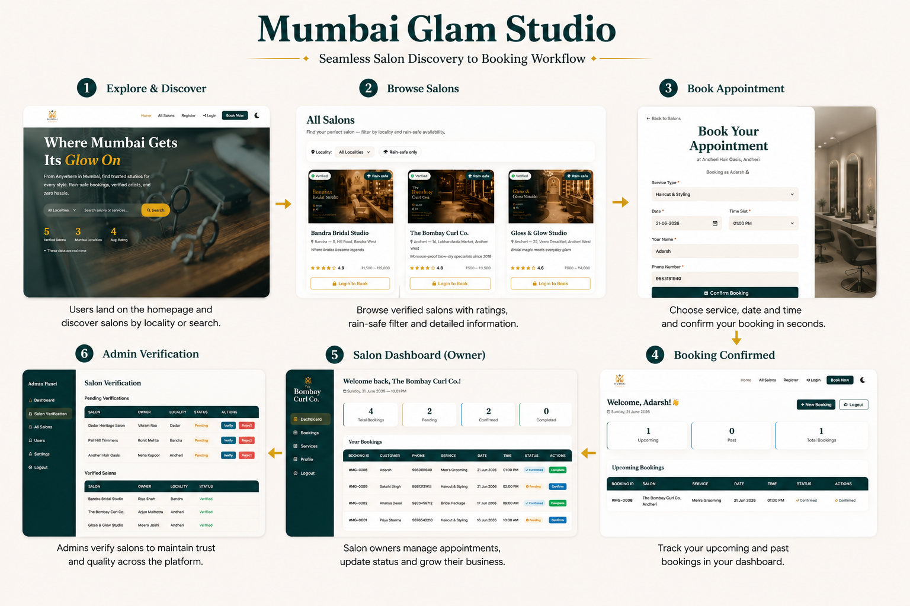
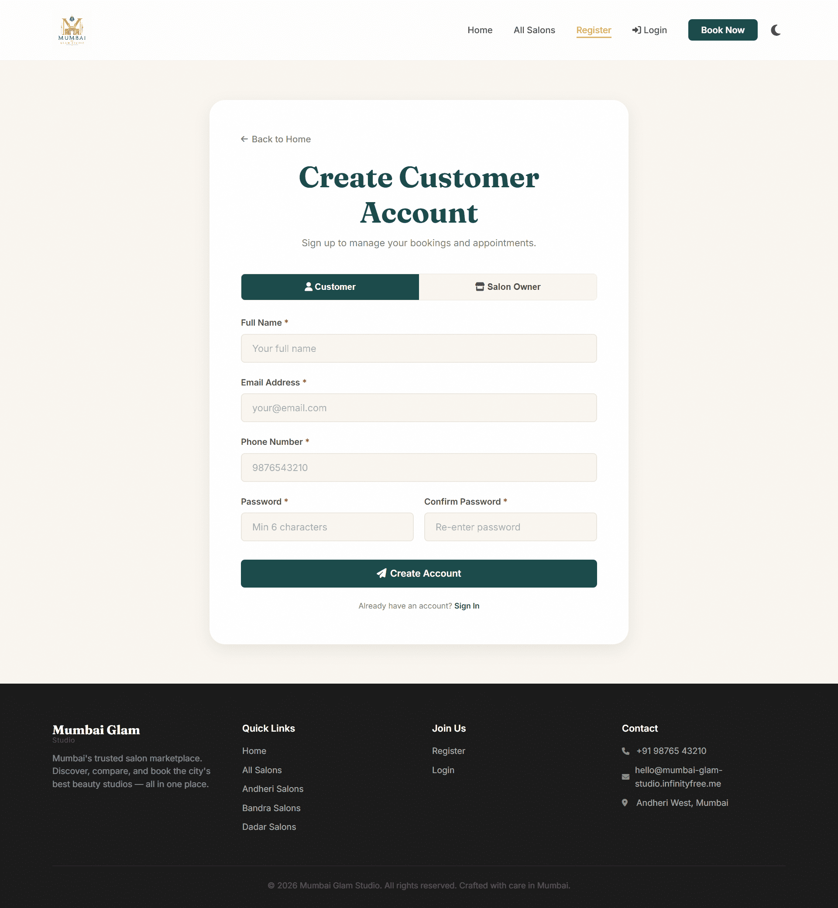

<p align="center">
  
</p>

<h1 align="center">Mumbai Glam Studio</h1>

<p align="center">
  <strong>✨ Where Mumbai Gets Its Glow On ✨</strong>
</p>

<p align="center">
  A luxury beauty salon marketplace connecting customers with trusted salons across Mumbai through seamless discovery, booking, and business management.
</p>

<p align="center">
  
  
  
  
  
  
</p>

---
# 🌐 Live Platform

### 🔗 Live Website

**https://mumbai-glam-studio.infinityfree.me/**

---

## 🔄 Platform Workflow

<p align="center">
  
</p>

<p align="center">
  <em>Complete customer-to-salon journey from discovery to appointment management.</em>
</p>

---
# 🏆 SuperXgen AI Startup Buildathon 2026

### Challenge Category

**Mumbai Salon Marketplace**

Mumbai Glam Studio was built as a startup-style MVP during the SuperXgen AI Startup Buildathon 2026.

### Vision

To create a centralized digital ecosystem where customers can discover trusted salons effortlessly while salon owners can manage and grow their businesses through technology.

### Goal

> Build a modern, scalable beauty marketplace that helps customers discover trusted salons while empowering salon owners with digital booking management tools.

---
# 💡 Problem Statement

Mumbai is home to thousands of beauty salons, yet discovering reliable salons and managing appointments remains fragmented.

### Customers often face:

- ❌ Lack of trusted salon discovery
- ❌ No centralized booking platform
- ❌ Difficulty comparing services
- ❌ Inconsistent business visibility
- ❌ Time-consuming appointment scheduling

### For salon owners:

- ❌ Limited online presence
- ❌ Poor customer retention systems
- ❌ Manual appointment management

Mumbai Glam Studio addresses these challenges through a unified marketplace experience.

---
# 🚀 Solution

Mumbai Glam Studio is a full-stack beauty-tech marketplace that enables:

## 👩 For Customers

- Browse salons by locality
- Compare services and pricing
- View detailed salon profiles
- Book appointments instantly
- Track upcoming bookings
- View booking history
- Manage appointments from a dedicated dashboard
- Find rain-safe salons

## 💇 For Salon Owners

- Register and list salons
- Upload salon images
- Receive appointment requests
- Manage bookings
- Update booking status
- Set rain-safe status
- Increase online visibility

## 🛡 For Platform Administrators

- Verify salons
- Moderate listings
- Remove spam listings
- Maintain marketplace quality and trust

---
# ✨ Key Features

## 🔍 Smart Salon Discovery

Users can discover salons through:

- Locality-based search
- Dynamic locality dropdown
- Premium salon cards
- Rating display
- Service visibility
- Rain-safe filtering
- Verified salon badges

---
## ☔ Rain-Safe Salon Filter

Mumbai's monsoon season often disrupts plans.

The platform includes a dedicated Rain-Safe Filter that helps customers instantly discover salons that:

- Operate fully indoors
- Have weather-protected facilities
- Minimize appointment disruption risks

This feature is uniquely designed for Mumbai's lifestyle challenges.

---
## 📅 Appointment Booking System

Customers can:

1. Select services
2. Choose dates
3. Pick time slots
4. Confirm bookings instantly

### Booking Flow

```text
Customer selects salon
        ↓
Clicks "Book Appointment"
        ↓
Login required
        ↓
Select service, date and time
        ↓
Confirm booking
        ↓
Booking ID generated (#MG-XXXX)
        ↓
Customer dashboard updated
        ↓
Salon owner receives booking request
```

The system prevents duplicate slot allocation and maintains booking integrity.

---
## 👤 Customer Dashboard

A dedicated customer portal provides:

- Upcoming Bookings
- Past Bookings
- Booking Status Tracking
- Appointment History
- Booking Statistics
- Quick Access to Salon Discovery

### Dashboard Highlights

- View all upcoming appointments
- Track booking status in real-time
- Access booking history
- Monitor completed appointments
- View salon information directly from bookings

The dashboard provides customers with complete visibility over their salon appointments and booking activities.

---
## 🏢 Salon Dashboard

Salon owners receive a dedicated management dashboard that helps them streamline operations.

### Features

- Appointment Management
- Customer Information Access
- Booking Status Updates
- Booking Analytics
- Operational Dashboard

### Dashboard Analytics

- Total Bookings
- Pending Bookings
- Confirmed Bookings
- Completed Bookings

### Status Flow

```text
Pending
   ↓
Confirmed
   ↓
Completed
```

Salon owners can efficiently manage customer appointments through a centralized interface.

---
## 🛡 Admin Verification System

Marketplace quality is maintained through an admin verification pipeline.

### Administrators Can

- Verify salon registrations
- Grant Verified badges
- Remove spam listings
- Moderate marketplace content
- Maintain platform trust

### Benefits of Verification

Verified salons receive:

- Enhanced credibility
- Better customer trust
- Improved marketplace visibility

This ensures customers interact with trusted and legitimate businesses.

---
## 🌙 Dark Mode Default

Mumbai Glam Studio features a luxury dark mode as its default theme.

### Features

- Dark Mode Enabled by Default
- Persistent User Preferences
- Theme Toggle Support
- Premium Color Palette
- Responsive Design Compatibility

### Theme Toggle

- ☀️ Switch to Light Mode
- 🌙 Switch to Dark Mode

The dark interface delivers a modern and elegant experience while improving visual comfort.

---
## 📊 Dynamic Marketplace Intelligence

The homepage dynamically displays marketplace statistics generated from live database queries.

### Real-Time Metrics

- Total Verified Salons
- Active Mumbai Localities
- Community Average Ratings

### Benefits

- Live marketplace insights
- Enhanced customer confidence
- Better platform transparency

All metrics are automatically updated based on the latest platform activity.

---
## 🔐 Unified Login System

Mumbai Glam Studio provides a single login portal for all user roles.

| User Type | Login Method | Redirect |
|------------|------------|------------|
| Customer | Email + Password | Customer Dashboard |
| Salon Owner | Username + Password | Salon Dashboard |
| Admin | Username + Password | Admin Dashboard |

### Security Features

- Password Hashing
- Session Authentication
- Role-Based Access Control
- Secure Logout

---
## 📝 Customer & Salon Registration

The platform supports onboarding for both customers and salon owners.

### Customer Registration

Users can register with:

- Full Name
- Email Address
- Phone Number
- Password

### Salon Owner Registration

Salon owners can submit:

- Salon Name
- Locality
- Address
- Description
- Services
- Facilities
- Contact Information
- Pricing Details
- Rain-Safe Status
- Salon Image

Both registration types are available through a unified registration interface.

---
## ⭐ Customer Reviews

Customers can share their experiences through the built-in review system.

### Review Features

- 1–5 Star Ratings
- Written Reviews
- Public Review Display
- Review Count Tracking
- Instant Visibility

### Benefits

- Increased transparency
- Better customer confidence
- Improved salon credibility
- Enhanced decision making

Reviews help create a trustworthy marketplace ecosystem.

---
# 📸 Product Showcase

All screenshots below were captured using the platform's premium dark theme.

---

## 🔄 Platform Workflow

<p align="center">
  
</p>

<p align="center">
  <em>Complete customer-to-salon journey from discovery to appointment management.</em>
</p>

---

## 🏠 Home Page

<p align="center">
  
</p>

<p align="center">
  <em>Luxury marketplace landing page featuring real-time statistics and smart salon discovery.</em>
</p>

---

## 💇 Salon Directory

<p align="center">
  
</p>

<p align="center">
  <em>Discover verified salons across Mumbai using locality-based filtering.</em>
</p>

---

## 📄 Salon Details Page

<p align="center">
  
</p>

<p align="center">
  <em>Comprehensive salon profiles including services, facilities, ratings and reviews.</em>
</p>

---

## 📅 Appointment Booking

<p align="center">
  
</p>

<p align="center">
  <em>Simple appointment booking workflow with date and time selection.</em>
</p>

---

## 👤 Customer Dashboard

<p align="center">
  
</p>

<p align="center">
  <em>Manage appointments and track booking history.</em>
</p>

---

## 🏢 Salon Dashboard

<p align="center">
  
</p>

<p align="center">
  <em>Manage bookings, customers and operational activities.</em>
</p>

---

## 🛡 Admin Verification Panel

<p align="center">
  
</p>

<p align="center">
  <em>Verify salons and maintain marketplace quality.</em>
</p>

---

## 📝 Registration Page

<p align="center">
  
</p>

<p align="center">
  <em>Unified onboarding experience for customers and salon owners.</em>
</p>

---

## 🌙 Dark Mode Experience

<p align="center">
  
</p>

<p align="center">
  <em>Luxury dark theme providing a premium user experience.</em>
</p>

---
# 🤖 AI Development Workflow

Mumbai Glam Studio was built using an AI-first development approach, enabling rapid prototyping, faster development cycles, and efficient problem-solving throughout the Buildathon.

## AI Tools Used

| Tool | Purpose |
|--------|----------|
| ChatGPT | Product planning, architecture design, debugging, documentation |
| DeepSeek | Backend engineering assistance and code optimization |
| Cursor | AI-assisted coding and refactoring |
| Figma AI | UI/UX wireframing and design ideation |
| Prompt Engineering | Workflow acceleration and feature planning |

### AI Assisted Development Areas

#### Product Design
- Marketplace strategy
- User journey planning
- Feature prioritization
- Business model ideation

#### Development
- PHP architecture
- Database schema design
- Authentication systems
- Booking workflow implementation
- SQL query optimization

#### User Experience
- Layout generation
- Design refinement
- Interaction improvements
- Dark mode styling

#### Documentation
- Technical documentation
- GitHub repository management
- Buildathon presentation assets
- README creation

---
# 🏗 Technical Architecture

## Frontend

| Technology | Purpose |
|------------|----------|
| HTML5 | Page structure |
| CSS3 | Styling and design system |
| JavaScript (Vanilla) | Client-side interactions |
| Font Awesome | Icons |
| Google Fonts | Typography |

## Backend

| Technology | Purpose |
|------------|----------|
| PHP 8+ | Server-side processing |
| Session Authentication | User login sessions |
| Role-Based Access Control | Customer, Salon, Admin roles |
| Prepared Statements | Secure database operations |

## Database

| Technology | Purpose |
|------------|----------|
| MySQL | Data storage and management |
| Relational Tables | Users, Salons, Bookings, Reviews |
| Foreign Keys | Data integrity |
| Indexed Queries | Performance optimization |

## Hosting & Deployment

| Technology | Purpose |
|------------|----------|
| InfinityFree | Web Hosting |
| Git | Version Control |
| GitHub | Repository Management |

---
# 🔒 Security Features

Mumbai Glam Studio follows secure development practices to protect user data and platform integrity.

## Security Implementations

- Password Hashing using bcrypt
- Secure Session Authentication
- Prepared Statements for SQL Injection Prevention
- Input Sanitization and Validation
- Authentication Middleware
- Role-Based Authorization
- Protected Dashboard Routes
- Secure Logout Mechanism
- Server-Side Form Validation

## Access Control

| Role | Access |
|--------|--------|
| Customer | Customer Dashboard & Bookings |
| Salon Owner | Salon Dashboard & Management |
| Admin | Platform Verification & Moderation |

---
# 📂 Project Structure

```text
Mumbai_Glam_Studio/
│
├── assets/
│   ├── favicon.png
│   ├── logo.png
│   ├── salons/
│   └── screenshots/
│
├── includes/
│   ├── header.php
│   ├── nav.php
│   └── footer.php
│
├── index.php
├── salons.php
├── detail_salon.php
├── booking.php
├── login.php
├── register.php
├── dashboard.php
├── customer_dashboard.php
├── logout.php
│
├── config.php
├── database.sql
├── script.js
├── style.css
│
└── README.md
```

---
# 👥 Team

## Team Name

**Mumbai Glam Studio**

## Team Members

| Name | Role |
|--------|--------|
| Adarsh Pandey | Full Stack Developer |
| Nitin Maurya | Full Stack Developer |

---
# 🎯 Buildathon Deliverables

| Deliverable | Status |
|------------|---------|
| Live Website | ✅ Completed |
| GitHub Repository | ✅ Completed |
| AI Workflow Documentation | ✅ Completed |
| Startup MVP | ✅ Completed |
| Salon Marketplace | ✅ Completed |
| Booking System | ✅ Completed |
| Dashboard System | ✅ Completed |
| Dark Mode Experience | ✅ Completed |
| Admin Verification System | ✅ Completed |

---
# 🔑 Demo Credentials

### Customer Account

| Field | Value |
|--------|--------|
| Email | demo@example.com |
| Password | demo123 |

### Salon Owner Account

| Field | Value |
|--------|--------|
| Username | andheri1 |
| Password | demo123 |

### Admin Account

| Field | Value |
|--------|--------|
| Username | admin |
| Password | admin123 |

---
# 📝 License

This project was developed as part of the **SuperXgen AI Startup Buildathon 2026**.

Licensed under the **MIT License**.

You are free to use, modify, and distribute this project in accordance with the MIT License terms.

---
# 📧 Contact

## Live Website

https://mumbai-glam-studio.infinityfree.me/

## GitHub Repository

https://github.com/CodeWithAdarsh007/Mumbai_Glam_Studio

## Team

For questions, feedback, or collaboration opportunities, please contact the development team through GitHub.

---
# ❤️ Built for SuperXgen AI Startup Buildathon 2026

<p align="center">
  <strong>Built with ❤️ for Mumbai's Beauty Community</strong>
</p>

<p align="center">
  <em>Mumbai Glam Studio demonstrates how AI-assisted development can rapidly transform an idea into a fully functional startup MVP.</em>
</p>

<p align="center">
  <strong>Build. Innovate. Launch.</strong>
</p>
